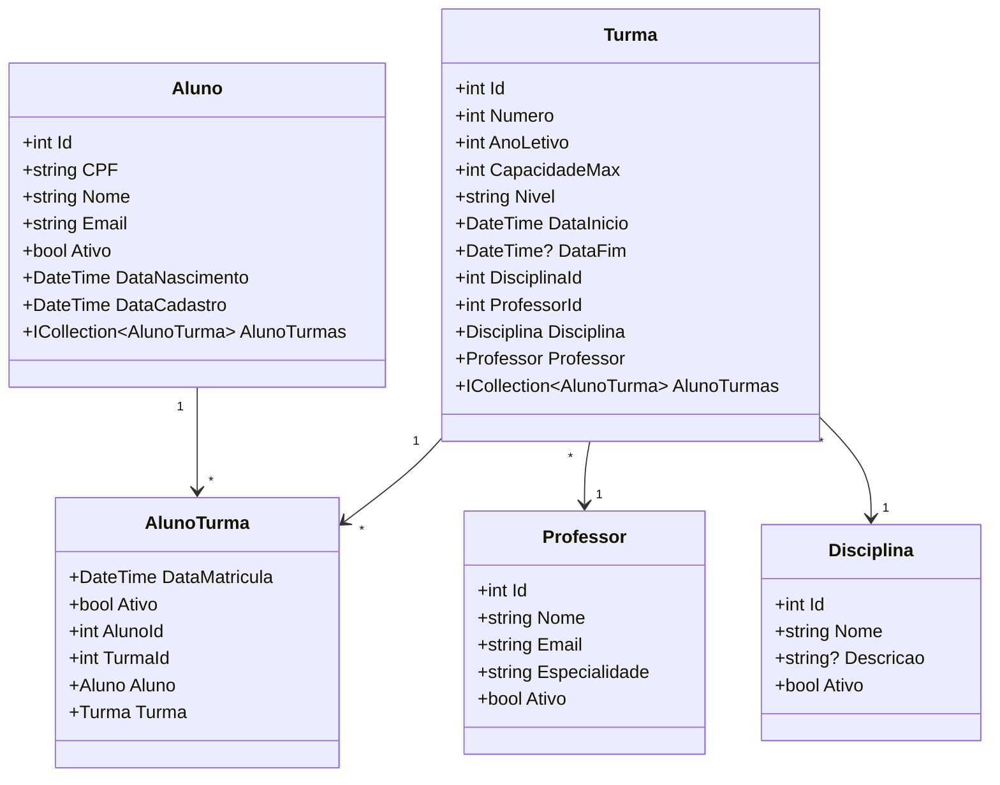

# SpeakCore API

API para gerenciamento de uma escola de idiomas, desenvolvida em **.NET 8** com arquitetura **DDD (Domain-Driven Design)**, **Entity Framework Core Code First** e **SQL Server**.  
Permite controlar alunos, turmas, professores e disciplinas, aplicando regras de negócio como limite de alunos por turma, validação de CPF/e-mail, impedimento de exclusão com dependências e trancamento de matrícula.

---

## Tecnologias

- **.NET 8** – plataforma de desenvolvimento
- **Entity Framework Core 8** – ORM para acesso a dados
- **SQL Server** – banco de dados relacional
- **Swagger / OpenAPI** – documentação interativa
- **Postman** – testes de integração

---

## Arquitetura

O projeto segue os princípios do **DDD**, com separação clara das responsabilidades:
SpeakCore/
  -SpeakCore.API # (Controllers, Swagger)
  -SpeakCore.Application # DTOs e Serviços (lógica de aplicação)
  -SpeakCore.Domain # Entidades, Enums, Interfaces de Repositório
  -SpeakCore.Infrastructure # Contexto, Repositórios, Migrations

text

---

## Pré‑requisitos

- [.NET 8 SDK](https://dotnet.microsoft.com/download/dotnet/8.0)
- SQL Server (Express, Developer ou LocalDB)
- Git

---


Regras de Negócio

          Aluno:
            -Deve ser cadastrado com pelo menos uma turma.
            -CPF deve ser válido (dígitos verificadores) e único.
            -E-mail deve ter formato válido e ser único.   
            -Não pode ser excluído se tiver matrícula ativa em qualquer turma.
        
          Turma:
           -Possui capacidade máxima de 5 alunos (considerando apenas matrículas ativas).
          - Não pode ser excluída se tiver alunos ativos matriculados.

          Professor
          -E-mail deve ser único.
          -Não pode ser excluído se possuir turmas vinculadas.

          Disciplina
          Nome único (não há restrição de exclusão, mas pode ser adicionada futuramente).

          Trancamento de Matrícula
          Uma matrícula pode ser inativada (Ativo = false) via PATCH.

          Matrículas inativas não contam para o limite de alunos da turma e não bloqueiam a exclusão do aluno ou da turma.


## Configuração e Execução

### 1. Clone o repositório

```bash
1.git clone https://github.com/seu-usuario/SpeakCore.git
cd SpeakCore

2. Configure a string de conexão
Edite o arquivo appsettings.json dentro de SpeakCore.API:
json
{
  "ConnectionStrings": {
    "DefaultConnection": "Server=(localdb)\\mssqllocaldb;Database=SpeakCoreDB;Trusted_Connection=True;MultipleActiveResultSets=true"
  }
}

3. Aplique as migrations para criar o banco de dados
bash
dotnet ef database update --project SpeakCore.Infrastructure --startup-project SpeakCore.API

4. Execute a API
bash
dotnet run --project SpeakCore.API
A API estará disponível em https://localhost:7111 (porta pode variar conforme configuração).

5. Acesse a documentação Swagger
Navegue até https://localhost:7111/swagger para testar os endpoints interativamente.


Como Testar

Usando Swagger
Execute a API.
Acesse https://localhost:7111/swagger. (ou a porta que sua api estiver rodando/swagger).
Expanda cada controller, clique em “Try it out” e preencha os dados.
Envie a requisição e veja a resposta.

Usando Postman
Importe a collection disponível em /postman/SpeakCore.postman_collection

Execute os endpoints na ordem: crie professor, disciplina, turma, aluno, etc.

Substitua {{base_url}} por https://localhost:7111 (ou a porta que sua API estiver rodando) e {{id}} pelo número de ID.

## Ordem Sugerida de Testes

Para validar o funcionamento completo da API, siga a ordem abaixo, respeitando as dependências entre os recursos:

1. Cadastrar Professor  
   `POST /api/Professor`  
   → Cria um professor que será vinculado a uma turma.

2. Cadastrar Disciplina  
   `POST /api/Disciplina`  
   → Cria uma disciplina que será vinculada a uma turma.

3. Cadastrar Turma  
   `POST /api/Turma`  
   → Utiliza os IDs do professor e da disciplina criados anteriormente.

4. Cadastrar Alunos  
   `POST /api/Aluno`  
   → Cria alunos já associados à turma criada. Repita para atingir o limite de 5 alunos.

5. Testar Limite da Turma 
   Ao tentar matricular um sexto aluno, a API deve retornar erro informando que a capacidade máxima foi atingida.

6. Listar Registros 
   `GET /api/Aluno`, `/api/Turma`, `/api/Professor`, `/api/Disciplina`  
   → Confirma que os dados foram persistidos corretamente.

7. Atualizar um Aluno (PUT) 
   `PUT /api/Aluno/{id}`  
   → Altere nome, e-mail ou turmas associadas.

8. Trancar Matrícula 
   `PATCH /api/Aluno/{alunoId}/turmas/{turmaId}/status`  
   → Desative uma matrícula (`false`). Verifique que o aluno não é mais contado para o limite da turma.

9. Excluir um Aluno 
   `DELETE /api/Aluno/{id}`  
   → Só deve funcionar se o aluno não tiver nenhuma matrícula ativa.

10. Excluir uma Turma
    `DELETE /api/Turma/{id}`  
    → Só deve funcionar se não houver alunos ativos nela.

11. Excluir um Professor
    `DELETE /api/Professor/{id}`  
    → Só deve funcionar se ele não estiver vinculado a nenhuma turma. Após excluir a turma, o professor poderá ser removido.

12. Excluir uma Disciplina
    `DELETE /api/Disciplina/{id}`  
    → Pode ser feito a qualquer momento, pois não há restrição de exclusão.

```
